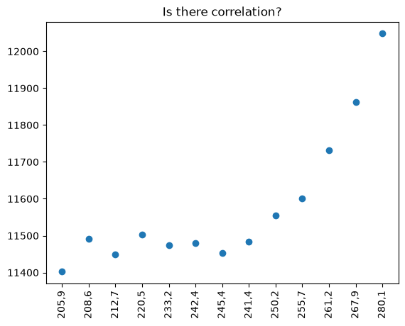

16097025

- Fantastic yeasts and where to find them: the hidden diversity of dimorphic fungal pathogens
- An analysis of the forces required to drag sheep over various surfaces
- Reading Acquisition, Developmental Dyslexia, and Skilled Reading Across Languages: A Psycholinguistic Grain Size Theory

**Figure**:

The figure shows a scatterplot between the number of students invloved in WO education in the Netherlands and Dutch beer consumption per year. The plot shows a positive trend between the two variables. The years in which the number of WO students was high tended to coincide with years with higher beer consumption which maight indicate a relationship between the two. Students are among the subsets of the population that consume some amount of alcohol.